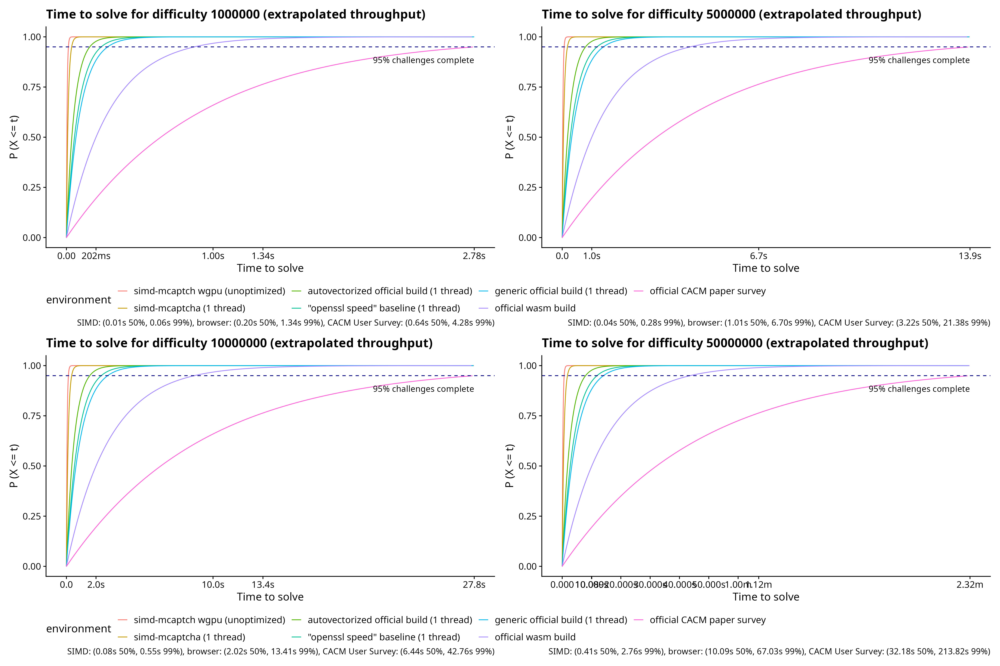

# simd-mCaptcha

## Table of Contents

- [simd-mCaptcha](#simd-mcaptcha)
  - [Table of Contents](#table-of-contents)
  - [Why?](#why)
  - [Limitations](#limitations)
  - [Ethical Disclaimer (i.e. the "How Dare you Publish this?" question)](#ethical-disclaimer-ie-the-how-dare-you-publish-this-question)
  - [Benchmark](#benchmark)
    - [Formal Benchmark (mCaptcha only)](#formal-benchmark-mcaptcha-only)
    - [End to End Benchmark](#end-to-end-benchmark)
      - [CPU only](#cpu-only)
    - [Throughput Sanity Check](#throughput-sanity-check)
      - [Single Threaded](#single-threaded)
      - [Multi Threaded](#multi-threaded)
  - [Security Implications](#security-implications)
  - [Future Work (i.e. Okay, so what would be a good PoW then?)](#future-work-ie-okay-so-what-would-be-a-good-pow-then)
  - [Contributing / Wishlist](#contributing--wishlist)
  - [License](#license)
  - [AI Disclaimer](#ai-disclaimer)

A fast, adversarially implemented mCaptcha/Anubis/go-away PoW solver, targeting AVX-512/SHA-NI/simd128 with an experimental shader in WGSL. Can be used for computing solutions to these systems without disabling privacy-enhancing features without wasting energy in the browser.

The benchmarks demonstrate a significant performance gap between browser-based JavaScript execution and native implementations (both optimized CPU and unoptimized GPU), suggesting fundamental challenges for PoW-based browser CAPTCHA systems.

[Web demo](https://powbuster.yumechi.jp/)

## Why?

I personally don't like some projects put themselves at the ethical high ground of "protecting the website" when they:
- Don't really protect the website better than heuristics (and this program serves as a proof of concept that it can be gamed using pure CPU).
- Requires users to disable their anti fingerprinting protection like JShelter, and don't give users an opportunity to re-enable them before automatically redirecting them to the a website they have never been to before, which can very well hide fingerprinting scripts. This program emits solutions to these challenges fast without requiring JavaScript.
- Justify the annoying friction by claiming the lack of a transparent spec and alternative manual solutions to be ["[good] taste [for] a 'security product'"](https://anubis.techaro.lol/docs/user/frequently-asked-questions), despite themselves not publishing sound security analysis to justify the friction. I did the reverse engineering that nobody should even have to do for an open source security product.

[A longer blabbing post regarding this](https://mi.yumechi.jp/notes/aa223tk8c5ao02v9)

## Limitations

We assume you have a relatively modern and powerful platform, specifically:

- Requires AVX-512 or SHA-NI CPU or simd128 on WASM. If you don't have any of these advanced instruction support, sorry, some "solutions" have "changed the way" of "security" (by paying with energy and battery life and making browsing on budget hardware hard), please use the vendor provided solutions.
- For Anubis target, this assumes the server is 64-bit (i.e. is able to accept a signed 64-bit nonce).
- AVX-512 build requires Rust 1.89 or later.
- This is designed for "low", practical-for-a-website difficulty settings, A $1 - P_{geom}(80e7, 1/\text{difficulty})$ chance of failure for any particular challenge, which for 1e8 (takes about 10 seconds on a browser for mCaptcha and an eternity for Anubis) is about 0.03%. Go-away solver explores the full solution space and guarantees a solution if one exists.
- The WGSL implementation may not be optimized for performance. I am not good at shader programming.

## Ethical Disclaimer (i.e. the "How Dare you Publish this?" question)

This isn't a vulnerability nor anything previously unknown, it's a structural weakness that needs to be assessed. I didn't "skip" or somehow "simplify" any number of SHA-2 rounds, it is a materialized analysis of performance characteristics of the system.

This is a structural limitation, PoW is supposed for global consensus, not maintaining a meaningful peer-to-peer "fair" hash rate margin, especially not when compared to commodity hardware. Every academic paper will tell you that PoW system loses protection margin using hardware or software optimizations. I implemented it, that's it.
 
Website operators deploying a PoW system bear the responsibility to understand the performance characteristics and security implications of their chosen PoW parameters, and whether that protects against their identified threat. __The purpose of this research is to provide the statistical analysis and empirical validation data necessary for informed deployment decisions, including optimized CPU only solutions.__ 

## Benchmark

Most of the formal comparison is done against mCaptcha, because they have a WASM solver and cannot be immediately dismissed as "that's JS overhead"/"we will do better later".

TLDR; My extrapolated throughput for each approach, corroborated by empirical and formal benchmarks:



Note: To reproduce, you don't need to clone the submodule, it is only used as a pointer for what I used to for benchmarking.

### Formal Benchmark (mCaptcha only)

Speedup against official solution, reported by Criterion.rs, single-threaded:

Results on AMD Ryzen 9 7950X, 32 cores, when supported, single-hash number comes first (there is 90% chance your deployment is single-hash, this vagueness is IMO design oversight by the mCaptcha team), double-hash number comes second, all numbers are in milliseconds, compiled with `-Ctarget-cpu=native` unless otherwise specified.


| DFactor    | AVX-512       | Safe Optimized (+) [^1] | Official (+*) | Official Generic x64 (+*) | wgpu (Vulkan) [^2] | User Survey extrapolated  [^3] |
| ---------- | ------------- | ----------------------- | ------------- | ------------------------- | ------------------ | ------------------------------ |
| 50_000     | 0.612/0.953   | 1.565                   | 2.851/4.009   | 5.600/9.537               | 0.097              | 14.556                         |
| 100_000    | 1.200/1.903   | 3.172                   | 5.698/7.817   | 11.152/18.575             | 0.126              | 29.11176                       |
| 1_000_000  | 11.708/18.515 | 31.622                  | 54.931/80.029 | 117.34/188.41             | 0.489              | 291.118                        |
| 4_000_000  | 45.330/75.630 | 125.06                  | 222.93/323.70 | 432.81/777.88             | 1.844              | 1164.471                       |
| 10_000_000 | 123.78/186.01 | 323.06                  | 564.41/805.02 | DNS                       | 4.201              | 2911.18                        |

(*) = Since official solution allocated a variable length string per iteration, it is pretty difficult to get it to perform it stably both in terms of how many blocks to hash and how long the allocation takes, serious non-linear performance degradation seems to be observed and it is likely attributed to re-allocation overhead.
(?) = not implemented, but I expect close to a clean double
(+) = SNA-NI and a standard SHA-256 implementation is used.

[^1]: Represents a custom implementation using safe, externally-validated cryptographic abstractions only and no platform-specific optimizations.
[^2]: NVIDIA RTX 4070 is used
[^3]: Manivannan, A.; Sethuraman, S. C.; Vimala Sudhakaran, D. P. MCaptcha: Replacing Captchas with Rate Limiters to Improve Security and Accessibility. Communications of the ACM 2024, 67 (10), 70–80. https://doi.org/10.1145/3660628.

### End to End Benchmark

A default official docker-compose instance is used for the benchmark target  (the default 33-byte salt was unchanged).

#### CPU only

The following were configured for difficulty 5_000_000 (default max tier).

10 consecutive solutions using the official Captcha widget:  [0.105s, 1.69s, 1.06s, 1.89s, 1.91s, 1.09s, 1.80s, 0.97s, 0.71s, 1.15s, 3.59s, 1.09s, 0.14s, 3.98s, 1.26s, 1.05s, 1.26s]

```sh
> RUSTFLAGS="-Ctarget-cpu=native" \
    cargo run --features cli --release -- live \
    --site-key emPgsyJP5SWeNEot2IBbg0ezOE1GNhof \
    --n-workers 38 \
    --do-control >/dev/null

You are hitting host http://localhost:7000
running 10 seconds of control sending random proofs
[0.0s] succeeded: 0, failed: 0, 5s: 0.0rps, 5s_failed: 0.0rps
[5.0s] succeeded: 725, failed: 0, 5s: 145.0rps, 5s_failed: 0.0rps
[10.0s] succeeded: 1453, failed: 0, 5s: 145.6rps, 5s_failed: 0.0rps
Fake Proof Control: 3732 requests in 10.1 seconds, 369.2 rps
[15.0s] succeeded: 2690, failed: 0, 5s: 247.4rps, 5s_failed: 0.0rps
[20.0s] succeeded: 3902, failed: 0, 5s: 242.4rps, 5s_failed: 0.0rps
[25.0s] succeeded: 5110, failed: 0, 5s: 241.6rps, 5s_failed: 0.0rps
[30.0s] succeeded: 6368, failed: 0, 5s: 251.6rps, 5s_failed: 0.0rps
[35.0s] succeeded: 7587, failed: 0, 5s: 243.8rps, 5s_failed: 0.0rps
[40.0s] succeeded: 8840, failed: 0, 5s: 250.6rps, 5s_failed: 0.0rps
[45.0s] succeeded: 10081, failed: 0, 5s: 248.2rps, 5s_failed: 0.0rps
[50.0s] succeeded: 11302, failed: 0, 5s: 244.2rps, 5s_failed: 0.0rps
[55.0s] succeeded: 12505, failed: 0, 5s: 240.6rps, 5s_failed: 0.0rps
[60.0s] succeeded: 13761, failed: 0, 5s: 251.2rps, 5s_failed: 0.0rps
```

Anubis "extreme suspicion" (4):

```sh
cargo run --features cli --release -- anubis \
    --url http://localhost:8923/ \
    --do-control \
    --n-workers 40 \
    >/dev/null

You are hitting host http://localhost:8923/, n_workers: 40
running 10 seconds of control sending random proofs
[0.0s] succeeded: 0, failed: 0, 5s: 0.0rps, 5s_failed: 0.0rps
[5.0s] succeeded: 34906, failed: 0, 5s: 6981.2rps, 5s_failed: 0.0rps
[10.0s] succeeded: 69816, failed: 0, 5s: 6982.0rps, 5s_failed: 0.0rps
Fake Proof Control: 81249 requests in 10.0 seconds, 8110.1 rps
[15.0s] succeeded: 132294, failed: 0, 5s: 12495.6rps, 5s_failed: 0.0rps
[20.0s] succeeded: 194841, failed: 0, 5s: 12509.4rps, 5s_failed: 0.0rps
[25.0s] succeeded: 257433, failed: 0, 5s: 12518.4rps, 5s_failed: 0.0rps
[30.0s] succeeded: 320410, failed: 0, 5s: 12595.4rps, 5s_failed: 0.0rps
[35.0s] succeeded: 383561, failed: 0, 5s: 12630.2rps, 5s_failed: 0.0rps
[40.0s] succeeded: 446068, failed: 0, 5s: 12501.4rps, 5s_failed: 0.0rps
[45.0s] succeeded: 509071, failed: 0, 5s: 12600.6rps, 5s_failed: 0.0rps
[50.0s] succeeded: 571523, failed: 0, 5s: 12490.4rps, 5s_failed: 0.0rps
[55.0s] succeeded: 633624, failed: 0, 5s: 12420.2rps, 5s_failed: 0.0rps
[60.0s] succeeded: 695687, failed: 0, 5s: 12412.6rps, 5s_failed: 0.0rps
```

All 32 cores of a AMD Ryzen 9 7950X are used for the end-to-end benchmark. It seems we are at the bottleneck of the server being able to record successful attempts, as further performance tuning only show improvement in offline benchmarks.

### Throughput Sanity Check

Just as a sanity check to make sure we are actually performing checks with effective data parallelism and the difference is not just because implementation overhead, here are the numbers from OpenSSL with SHA-NI support:

The program were built with `-Ctarget-feature=+avx512f` and `-Ctarget-feature=+sha,+avx` respectively and ran on 7950X with mitigations enabled.

#### Single Threaded

```sh
> openssl speed sha256
type             16 bytes     64 bytes    256 bytes   1024 bytes   8192 bytes  16384 bytes
sha256          207107.04k   645724.06k  1507281.95k  2220402.22k  2655970.10k  2687872.17k
```

The single-threaded throughput for OpenSSL with SHA-NI support is about 12.94 MH/s (828.2MB/s) single block, 42.00 MH/s (2.86 GB/s) continuous.

For us we have single thread:

| Workload                         | AVX-512 [log](time.txt) | SHA-NI [log](time_sha-ni.txt) |
| -------------------------------- | ----------------------- | ----------------------------- |
| SingleBlock/Anubis               | 76.86 MH/s              | 51.71 MH/s                    |
| DoubleBlock (mCaptcha edge case) | 44.47 MH/s              | 48.78 MH/s                    |
| go-away (16 bytes)               | 98.33 MH/s              | 79.46 MH/s                    |

The throughput on 7950X for Anubis and go-away is about 100kH/s on Chromium and about 20% of that on Firefox, this is corroborated by Anubis's own accounts in their code comments using 7950X3D empirical testing. Empirical throughput of WASM-based mCaptcha is unreliable due to lack of official benchmark tools, but should be around 2-4 MH/s, corroborated with the author's CACM paper.

#### Multi Threaded

The peak throughput reported by `openssl speed -multi 32 sha256` is 239.76 MH/s (15.34 GB/s) single block, 1.14 GH/s (73.24 GB/s) continuous.

| Workload                         | AVX-512     | SHA-NI      |
| -------------------------------- | ----------- | ----------- |
| SingleBlock/Anubis               | 1.290 GH/s  | 1.143 GH/s  |
| DoubleBlock (mCaptcha edge case) | 841.94 MH/s | 827.74 MH/s |
| go-away (16 bytes)               | 1.541 GH/s  | 1.291 GH/s  |

## Security Implications

The performance benchmarks demonstrate a fundamental challenge for browser-based PoW CAPTCHA systems:

1. The performance gap between optimized native code and browser JavaScript (>100x) makes it impractical to set difficulty levels that are both:
   - High enough to prevent automated solving on native hardware
   - Low enough to be solvable in browsers within reasonable timeouts

2. The GPU implementation, even unoptimized, shows that commodity hardware can solve high-difficulty challenges orders of magnitude faster than browsers.

These findings suggest that both designing and adopting a PoW-based CAPTCHA systems may need additional verification mechanisms beyond empirical testing.

## Future Work (i.e. Okay, so what would be a good PoW then?)

[See FUTURE.md](FUTURE.md)

## Contributing / Wishlist

Contributions are welcome, roughly in priority order we want:

0. A "Solver-as-a-Service" API so I can use it in a UserScript instead of manually "emulating" a solution.
1. General profiling and further optimization.
2. Would be nice to have a real WebGPU solution that runs side-by-side with the current real Captcha widget.
3. An AVX-2 solution and corresponding benchmark. (low priority as this isn't really a "product")

## License

This project is licensed under the Apache License 2.0. See the [LICENSE](LICENSE) file for details.

This project contains some copy pasted or minimally modified code from the [sha2](https://crates.io/crates/sha2) crate, in the core SHA-2 routine in [sha256.rs](src/sha256.rs).

## AI Disclaimer

YES, this crate includes AI generated code, does it matter?

- Can _anyone_ use AI to write this particular solution? Absolutely not, you have to give it enough context or direction, which requires human intelligence.
- Is the core logic generated or conceived by an AI? Absolutely not, it can't.
- Did AI "plagiarize" this solution? Absolutely, it plagiarized the FIPS 180-4 SHA-2 IV, round constants, and test vector, and "subtly" embedded it into my code, go figure if it is important to you.

  Little challenge to "human touch"/"tool usage" enjoyers: ssshhhhh... actually the AES key of my password manager is the SHA-256 of all the bytes in the source code that is typed by my keyboard concatenated together (sort files in alphabetical order), give it a crack! $1M reward!

That is why I argue gatekeeping or who is "good at programming" based on "AI usage" is a bad idea.

