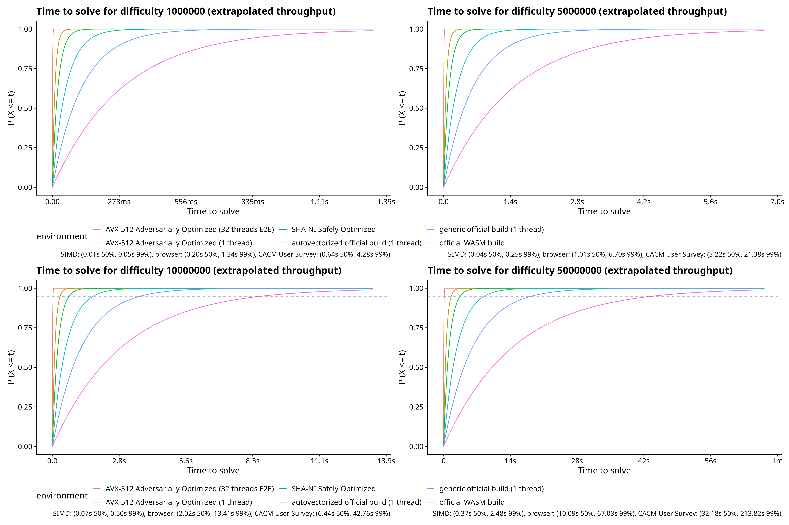

# PoW Buster

## Table of Contents

- [PoW Buster](#pow-buster)
  - [Table of Contents](#table-of-contents)
  - [Motivation / Why?](#motivation--why)
  - [Features](#features)
  - [Building](#building)
    - [Building the browser extension](#building-the-browser-extension)
  - [Limitations](#limitations)
  - [Ethical Disclaimer (i.e. the "How Dare you Publish this?" question)](#ethical-disclaimer-ie-the-how-dare-you-publish-this-question)
  - [Benchmark](#benchmark)
    - [Formal Benchmark (mCaptcha only)](#formal-benchmark-mcaptcha-only)
    - [End to End Benchmark](#end-to-end-benchmark)
      - [CPU only](#cpu-only)
    - [Cap.js Browser Comparison](#capjs-browser-comparison)
    - [Throughput Sanity Check](#throughput-sanity-check)
      - [Single Threaded](#single-threaded)
      - [Multi Threaded](#multi-threaded)
  - [Security Implications and Responsible Reporting](#security-implications-and-responsible-reporting)
  - [Future Work (i.e. Okay, so what would be a good PoW then?)](#future-work-ie-okay-so-what-would-be-a-good-pow-then)
  - [Conflict of Interest Disclosure](#conflict-of-interest-disclosure)
  - [Contributing / Wishlist](#contributing--wishlist)
  - [License and Acknowledgments](#license-and-acknowledgments)
  - [AI Disclaimer](#ai-disclaimer)

A fast, data-parallel, adversarially [^3] implemented mCaptcha/Anubis/Cerberus/go-away/Cap.js PoW solver, targeting AVX-512/SHA-NI/simd128. Can be used for computing solutions to these systems without disabling privacy-enhancing features, without wasting energy in the browser.

[^3]: Adversarial refers to challenges are solved using the path-of-least-resistance, sometimes involving massaging nonce space into favorable conditions or partially inverting hash images into lower-latency internal states. Most schemes supported do not have explicit specifications and depend on the cryptographic guarantees of the hash function, which I did not break (at least not in a previously unknown way). This code follows the original code to the letter of the law and sometimes emit awkward but computationally or statistically favorable solutions (such as `10000000073377131`, `-10.00000141128212`, etc.)

The benchmarks demonstrate a significant performance gap between browser-based JavaScript execution and native implementations, suggesting fundamental challenges for PoW-based browser CAPTCHA systems.

[Public web demo running on Netcup (R) RS 2000 G12, 8vCPU server at MSRP 14.58EUR/month](https://powbuster.yumechi.jp/). Ballparking 80-100MH/s/thread for SHA-2 and 170MH/s/thread for BLAKE3.

## Motivation / Why?

See [MOTIVATION.md](MOTIVATION.md) for more details.


[A longer blabbing post regarding this](https://mi.yumechi.jp/notes/aa223tk8c5ao02v9)

## Features

- SHA-2 and BLAKE3 hotstarting with round-level precomputation granularity
- Structure of Array hashing backed by register-resident SIMD.
- 3 searching modes: Prefix greater than (mCaptcha), prefix less than (Anubis/go-away), mask test (Cerberus/Cap.js)
- Greedy padding logic with 64-bit integer and floating point nonce stretching
- Efficient outer loop and SIMD nonce encoding
- Fully unrolled and monomorphic core friendly to pipelining and ternary logic instruction lowering
- Short-circuiting comparison with $H_1 \to H_7$ feed-forward elision with optional 64-bit support
- Switch to octal nonces when success rate is overwhelming
- An API compatible with [anubis_offload](https://github.com/DavidBuchanan314/anubis_offload/) but doesn't need a GPU to run.

## Building

MSRV: Rust 1.89+.

Requires AVX-512 (cpuid: `avx512f`) or SHA-NI+SSE4.1 (cpuid: `sha`, `sse4_1`) CPU or SIMD128 on WASM. If you don't have any of these advanced instruction support, sorry, some "solutions" have "changed the way" of "security" (by paying with energy and battery life and making browsing on budget hardware hard). There is a pure Rust scalar fallback that should make the code compile and work regardless.

Recommended CPU feature flags in order of preference (Tagged releases will have Linux musl builds):

- `-Ctarget-cpu=native`
- `-Ctarget-feature=+avx512vbmi` (Artifacts released on top of x86-64-v4)
- `-Ctarget-feature=+avx512f` (Artifacts released on top of x86-64-v3)
- `-Ctarget-feature=+sha,+avx2` (Artifacts released on top of x86-64-v2)
- `-Ctarget-feature=+avx2` (only BLAKE3 will be accelerated!)
- `-Ctarget-feature=+sha,+sse4_1` (only SHA-2 will be accelerated!)

```sh
RUSTFLAGS="-Ctarget-cpu=native" cargo build --release --features cli
```

Optional Features:

- `compare-64bit`: Compare 64-bit words instead of 32-bit words at ~5% penalty, almost never needed for realistic challenges. Not compatible with WASM.
- `client`: End-to-end solver client, required for most non-computational functionality.
- `live-throughput-test`: End-to-end multi-worker throughput benchmark.
- `server`: Solver-as-a-Service API. It is recommended to also use `--profile release-unwinding` instead of `--release` to prevent unexpected panics from aborting the server.
- `server-wasm`: Solver-as-a-Service API (with WASM simd128 solver, build first with `./build_wasm.sh`).

Demo:

```sh
> time target/release/pow-buster anubis --url https://git.kernel.org/pub/scm/linux/kernel/git/torvalds/linux.git/diff/

set-cookie: techaro.lol-anubis-auth=eyJeyJhbGciOiJFZERTQSIsInR5cCI6IkpXVCJ9.ey<...>

________________________________________________________
Executed in  491.36 millis    fish           external
   usr time    7.08 millis  390.00 micros    6.69 millis
   sys time    8.95 millis  114.00 micros    8.83 millis
```

```sh
> target/release/pow-buster server & # require `server` feature
> curl --data-urlencode challenge='{"rules":{"algorithm":"fast","difficulty":6,"report_as":6},"challenge":"xxxxxx"}' localhost:8080/solve

// elapsed time: 29ms; attempted nonces: 2535920; 81.04 MH/s; 1.27% limit used
window.location.replace("/.within.website/x/cmd/anubis/api/pass-challenge?elapsedTime=2476&response=000000434df465134b51abbde017562b007c8239764d9fdce61817b4c306d304&nonce=11111111140158495&redir=" + encodeURIComponent(window.location.href));
```

### Building the browser extension

The browser extension bundles a SIMD128 WASM solver for Anubis and Cerberus that is much more performant and energy-efficient than vendor-provided solvers and optionally can be configured to fetch solutions from a remote `pow-buster` server.

```sh
> ./build_wasm.sh
> cd browser-addon && web-ext build
```

Browser addons will be released _unsigned_. To install it you have to: 

- Get it signed under your developer account, or
- On any Firefox browser that is not the release flavor (e.g. Nightly, LibreWolf, etc.), manually flip `xpinstall.signatures.required` to `false` in `about:config` to install them.

For easier to use (but less reliable) alternatives, I highly recommend trying out the [NoPoW](https://git.gay/49016/NoPoW) extension (which is signed by Mozilla because it is just a UA changer), main differences:

- ✅ Works on non-default or challenge-all config. 
- ✅ Resistant to adopters who like to block specific request signatures because there is no request signature - vanilla vendor submission code is used.
- ✅ Does not try to circumvent any administrative rules, code is law.
- ❌ Will still "waste" CPU cycles, just (much) more efficiently.
- ❌ The extension may violate Firefox Submission Guideline of being "self contained". Although it can (and by default does) work without any server-side components, you have the option to use the preferences page to have it connect to a native `pow-buster` server and execute solution scripts generated by the server. This is to simplify my workflow of just having one server-side integration and increase agility of getting native acceleration from manual devTools based workflows to fully automated ones.

## Limitations

We assume you have a relatively modern and powerful platform, specifically:

- A cold optimized build with end-to-end features may take up to 5 minutes as this program aggressively generates specialized kernels and build time isn't my priority.
- For Anubis target, this assumes the server is 64-bit (i.e. is able to accept a signed 64-bit nonce).
- AVX-512 build requires Rust 1.89 or later.
- All solvers are single-threaded and are intended to be scaled up using multiple workers optionally pinned to specific cores.
- This is designed for "low", practical-for-a-website difficulty settings, A worst-case $1 - P_{geom}(80e7, 1/\text{difficulty})$ chance of failure for any particular messaeg offset with most offset cases almost guaranteed to succeed eventually, which for 1e8 (takes about 10 seconds on a browser for mCaptcha and an eternity for Anubis) is about 0.03%. Go-away solver explores the full solution space and guarantees a solution if one exists.

## Ethical Disclaimer (i.e. the "How Dare you Publish this?" question)

This isn't a vulnerability nor anything previously unknown, it's a structural weakness that needs to be assessed. I didn't "skip" or somehow "simplify" any number of SHA-2 rounds, it is a materialized analysis of performance characteristics of the system.

This is a structural limitation, PoW is supposed for global consensus, not maintaining a meaningful peer-to-peer "fair" hash rate margin, especially not when compared to commodity hardware. Every academic paper will tell you that PoW system loses protection margin using hardware or software optimizations. I implemented it, that's it.
 
Website operators deploying a PoW system bear the responsibility to understand the performance characteristics and security implications of their chosen PoW parameters, and whether that protects against their identified threat. __The purpose of this research is to provide the statistical analysis and empirical validation data necessary for informed deployment decisions, including optimized CPU only solutions.__ 

## Benchmark

Most of the formal comparison is done against mCaptcha, because they have a WASM solver and cannot be immediately dismissed as "that's JS overhead"/"we will do better later".

TLDR; My extrapolated throughput for each approach, corroborated by empirical and formal benchmarks:



### Formal Benchmark (mCaptcha only)

Speedup against official solution, reported by Criterion.rs, single-threaded except for "mCaptcha User Survey extrapolated" column which uses all worker threads on the user's browser:

Results on AMD Ryzen 9 7950X, 32 hyperthreads, when supported, single-hash number comes first (there is 90% chance your deployment is single-hash, this vagueness is IMO design oversight by the mCaptcha team), double-hash number comes second, all numbers are in milliseconds, compiled with `-Ctarget-cpu=native` unless otherwise specified.

| DFactor (equiv. Anubis difficulty) | AVX-512       | AVX-512 (32-byte salt) | Safe Optimized (+) [^1] | mCaptcha (+)  | mCaptcha Generic x64 (+) | mCaptcha User Survey extrapolated [^2] |
| ---------------------------------- | ------------- | ---------------------- | ----------------------- | ------------- | ------------------------ | -------------------------------------- |
| 50_000 (3.90)                      | 0.554/0.953   | 0.487                  | 1.565                   | 2.851/4.009   | 5.600/9.537              | 14.556                                 |
| 100_000 (4.15)                     | 1.105/1.903   | 0.978                  | 3.172                   | 5.698/7.817   | 11.152/18.575            | 29.11176                               |
| 1_000_000 (4.98)                   | 11.138/18.515 | 9.707                  | 31.622                  | 54.931/80.029 | 117.34/188.41            | 291.118                                |
| 4_000_000 (5.48)                   | 46.136/75.630 | 37.475                 | 125.06                  | 222.93/323.70 | 432.81/777.88            | 1164.471                               |
| 10_000_000 (5.81)                  | 107.49/186.01 | 94.645                 | 323.06                  | 564.41/805.02 | DNS                      | 2911.18                                |

(+) = SNA-NI and a standard SHA-256 implementation is used.

[^1]: Represents a custom implementation using safe, externally-validated cryptographic abstractions only and no platform-specific optimizations.
[^2]: Manivannan, A.; Sethuraman, S. C.; Vimala Sudhakaran, D. P. MCaptcha: Replacing Captchas with Rate Limiters to Improve Security and Accessibility. Communications of the ACM 2024, 67 (10), 70–80. [https://doi.org/10.1145/3660628](https://doi.org/10.1145/3660628).

### End to End Benchmark

A default official docker-compose instance is used for the benchmark target  (the default 33-byte salt was unchanged).

#### CPU only

The following were configured for difficulty 5_000_000 (default max tier).

10 consecutive solutions using the official Captcha widget:  [0.105s, 1.69s, 1.06s, 1.89s, 1.91s, 1.09s, 1.80s, 0.97s, 0.71s, 1.15s, 3.59s, 1.09s, 0.14s, 3.98s, 1.26s, 1.05s, 1.26s]

```sh
> RUSTFLAGS="-Ctarget-cpu=native" \
    cargo run --features cli --release -- live \
    --site-key emPgsyJP5SWeNEot2IBbg0ezOE1GNhof \
    --n-workers 38 \
    --do-control >/dev/null

You are hitting host http://localhost:7000
running 10 seconds of control sending random proofs
[0.0s] succeeded: 0, failed: 0, 5s: 0.0rps, 5s_failed: 0.0rps
[5.0s] succeeded: 725, failed: 0, 5s: 145.0rps, 5s_failed: 0.0rps
[10.0s] succeeded: 1453, failed: 0, 5s: 145.6rps, 5s_failed: 0.0rps
Fake Proof Control: 3732 requests in 10.1 seconds, 369.2 rps
[15.0s] succeeded: 2690, failed: 0, 5s: 247.4rps, 5s_failed: 0.0rps
[20.0s] succeeded: 3902, failed: 0, 5s: 242.4rps, 5s_failed: 0.0rps
[25.0s] succeeded: 5110, failed: 0, 5s: 241.6rps, 5s_failed: 0.0rps
[30.0s] succeeded: 6368, failed: 0, 5s: 251.6rps, 5s_failed: 0.0rps
[35.0s] succeeded: 7587, failed: 0, 5s: 243.8rps, 5s_failed: 0.0rps
[40.0s] succeeded: 8840, failed: 0, 5s: 250.6rps, 5s_failed: 0.0rps
[45.0s] succeeded: 10081, failed: 0, 5s: 248.2rps, 5s_failed: 0.0rps
[50.0s] succeeded: 11302, failed: 0, 5s: 244.2rps, 5s_failed: 0.0rps
[55.0s] succeeded: 12505, failed: 0, 5s: 240.6rps, 5s_failed: 0.0rps
[60.0s] succeeded: 13761, failed: 0, 5s: 251.2rps, 5s_failed: 0.0rps
```

Anubis "mild suspicion" (4, saturated Anubis Go runtime):

```sh
> target/release/pow-buster live --api-type anubis --host http://localhost:8923/ \
                                                    --n-workers 64

You are hitting host http://localhost:8923/, n_workers: 64
[0.0s] proofs accepted: 0, failed: 0, 5s: 0.0pps, 5s_failed: 0.0rps, 0.00% iowait
[5.0s] proofs accepted: 53805, failed: 0, 5s: 10761.0pps, 5s_failed: 0.0rps, 74.91% iowait
[10.0s] proofs accepted: 108805, failed: 0, 5s: 11000.0pps, 5s_failed: 0.0rps, 74.34% iowait
[15.0s] proofs accepted: 164656, failed: 0, 5s: 11170.2pps, 5s_failed: 0.0rps, 73.92% iowait
[20.0s] proofs accepted: 220786, failed: 0, 5s: 11226.0pps, 5s_failed: 0.0rps, 73.65% iowait
[25.0s] proofs accepted: 277543, failed: 0, 5s: 11351.4pps, 5s_failed: 0.0rps, 73.43% iowait
[30.0s] proofs accepted: 335189, failed: 0, 5s: 11529.2pps, 5s_failed: 0.0rps, 73.10% iowait
[35.0s] proofs accepted: 392865, failed: 0, 5s: 11535.2pps, 5s_failed: 0.0rps, 72.80% iowait
[40.0s] proofs accepted: 450552, failed: 0, 5s: 11537.4pps, 5s_failed: 0.0rps, 72.56% iowait
[45.0s] proofs accepted: 508698, failed: 0, 5s: 11629.2pps, 5s_failed: 0.0rps, 72.35% iowait
[50.0s] proofs accepted: 566663, failed: 0, 5s: 11593.0pps, 5s_failed: 0.0rps, 72.20% iowait
[55.0s] proofs accepted: 624373, failed: 0, 5s: 11542.0pps, 5s_failed: 0.0rps, 72.08% iowait
[60.0s] proofs accepted: 681909, failed: 0, 5s: 11507.2pps, 5s_failed: 0.0rps, 71.99% iowait
```

Anubis "extreme suspiction" (6):

```sh
> target/release/pow-buster live --api-type anubis --host http://localhost:8923/ \
                                                    --n-workers 32

You are hitting host http://localhost:8923/, n_workers: 32
[0.0s] proofs accepted: 0, failed: 0, 5s: 0.0pps, 5s_failed: 0.0rps, 0.00% iowait
[5.0s] proofs accepted: 426, failed: 0, 5s: 85.2pps, 5s_failed: 0.0rps, 0.53% iowait
[10.0s] proofs accepted: 843, failed: 0, 5s: 83.4pps, 5s_failed: 0.0rps, 0.43% iowait
[15.1s] proofs accepted: 1291, failed: 0, 5s: 89.6pps, 5s_failed: 0.0rps, 0.41% iowait
[20.0s] proofs accepted: 1727, failed: 0, 5s: 87.2pps, 5s_failed: 0.0rps, 0.39% iowait
[25.0s] proofs accepted: 2179, failed: 0, 5s: 90.4pps, 5s_failed: 0.0rps, 0.38% iowait
[30.0s] proofs accepted: 2625, failed: 0, 5s: 89.2pps, 5s_failed: 0.0rps, 0.37% iowait
[35.0s] proofs accepted: 3069, failed: 0, 5s: 88.8pps, 5s_failed: 0.0rps, 0.37% iowait
[40.0s] proofs accepted: 3477, failed: 0, 5s: 81.6pps, 5s_failed: 0.0rps, 0.36% iowait
[45.0s] proofs accepted: 3880, failed: 0, 5s: 80.6pps, 5s_failed: 0.0rps, 0.35% iowait
[50.0s] proofs accepted: 4289, failed: 0, 5s: 81.8pps, 5s_failed: 0.0rps, 0.34% iowait
[55.0s] proofs accepted: 4734, failed: 0, 5s: 89.0pps, 5s_failed: 0.0rps, 0.34% iowait
[60.0s] proofs accepted: 5180, failed: 0, 5s: 89.2pps, 5s_failed: 0.0rps, 0.34% iowait
```

All 32 hyperthreads of a AMD Ryzen 9 7950X are used for the end-to-end benchmark. It seems we are at the bottleneck of the server being able to record successful attempts, as further performance tuning only show improvement in offline benchmarks.

### Cap.js Browser Comparison

Cap.js is a good end-to-end comparison target since it:
- Uses multiple sub-goals instead of one big goal, results in a normal instead of geometric distribution of solution times
- Has an official browser benchmark performed by BrowserStack
- Has a WASM solver written in Rust

Cap.js got [the following benchmark](https://github.com/tiagozip/cap/blob/0c6f140724cfad7500d3b9f59b1387c9bd91e672/docs/guide/benchmark.md) as of 09/12/2025:

| Tier      | Device             | Chrome | Safari |
| --------- | ------------------ | ------ | ------ |
| Low-end   | Samsung Galaxy A11 | 4.583s | -      |
| Low-end   | iPhone SE (2020)   | -      | 1.282s |
| Mid-range | Google Pixel 7     | 1.027s | -      |
| Mid-range | iPad (9th gen)     | –      | 1.401s |
| High-end  | Google Pixel 9     | 0.894s | –      |
| High-end  | MacBook Air M3     | 0.312s | 0.423s |

Tested with BrowserStack using the following configuration:

- **Challenge difficulty:** 4
- **Number of challenges:** 50
- **Salt/challenge size:** 32
- **Number of benchmarks:** 50

We set up a local Cap.js server, set it to the same difficulty but 5000 subgoals instead of 50.

```sh
> target/release/pow-buster cap-js --site-key 8b4574013b --url http://localhost:3000/

challenge: CapJsChallengeDescriptor { rules: CapJsChallengeRules { count: 5000, salt_length: 32, difficulty: 4 }, token: "58c59bcc0395e2ee385ed2306581d2d5720079370967838c6b" }
{
  "token": "04d15ccd0a853a79:1fa4246e098cbcf7e9d0b946a44f42",
  "expires": 1757723993381,
  "_meta": {
    "elapsed_us": 199841,
    "attempted_nonces": 326359936,
    "hashrate": 1633097992
  }
}
```

We solved it in ~200ms using 32-threads on a 7950X at 1.633 GH/s (faster because of hotstarting), and about 150x faster than MacBook Air M3. Taking out the thread count
lead (32 threads on 7950X, 8 threads on MacBook Air M3), we are at about 40x "net" speedup per thread.

### Throughput Sanity Check

Just as a sanity check to make sure we are actually performing checks with effective data parallelism and the difference is not just because implementation overhead, here are the numbers from OpenSSL with SHA-NI support:

The program were built with `-Ctarget-feature=+avx512f` and `-Ctarget-feature=+sha,+avx` respectively and ran on 7950X with mitigations enabled.

#### Single Threaded

```sh
> openssl speed sha256
type             16 bytes     64 bytes    256 bytes   1024 bytes   8192 bytes  16384 bytes
sha256          207107.04k   645724.06k  1507281.95k  2220402.22k  2655970.10k  2687872.17k
```

The single-threaded throughput for OpenSSL with SHA-NI support is about 12.94 MH/s (828.2MB/s) single block, 42.00 MH/s (2.86 GB/s) continuous.

For us we have single thread:

| Workload                         | AVX-512 [log](time.txt) | SHA-NI [log](time_sha-ni.txt) | Chromium SIMD128 [log](time_simd128.txt) |
| -------------------------------- | ----------------------- | ----------------------------- | ---------------------------------------- |
| SingleBlock/Anubis               | 89.16 MH/s              | 62.19 MH/s                    | 14.74 MH/s                               |
| DoubleBlock (mCaptcha edge case) | 53.28 MH/s              | 42.55 MH/s                    | Not Tested                               |
| go-away (32 bytes)               | 98.42 MH/s              | 78.10 MH/s                    | Not Tested                               |
| Cerberus (BLAKE3)                | 205.98 MH/s             | N/A                           | 49.86 MH/s                               |

On a mobile CPU (i7-11370H), similar performance can be achieved on AVX-512 (at a higher IPC due to Intel having faster register rotations):

| Workload                         | AVX-512     | SHA-NI     |
| -------------------------------- | ----------- | ---------- |
| SingleBlock/Anubis               | 72.30 MH/s  | 21.87 MH/s |
| DoubleBlock (mCaptcha edge case) | 44.84 MH/s  | 14.46 MH/s |
| go-away (32 bytes)               | 80.53 MH/s  | 20.42 MH/s |
| Cerberus (BLAKE3)                | 179.07 MH/s | N/A       |

The throughput on 7950X for Anubis and go-away is about 100kH/s on Chromium and about 20% of that on Firefox, this is corroborated by Anubis's own accounts in their code comments using 7950X3D empirical testing. Empirical throughput of WASM-based mCaptcha is unreliable due to lack of official benchmark tools, but should be around 2-4 MH/s, corroborated with the author's CACM paper.

#### Multi Threaded

The peak throughput on 7950X reported by `openssl speed -multi 32 sha256` is 239.76 MH/s (15.34 GB/s) single block, 1.14 GH/s (73.24 GB/s) continuous.

| Workload                         | AVX-512 [log](bench_sha2.log)     | SHA-NI      | Vendor Official on Chromium [^4] |
| -------------------------------- | ----------- | ----------- | -----------                      |
| SingleBlock/Anubis               | 1.465 GH/s  | 1.143 GH/s  | ~650kH/s                         |
| DoubleBlock (mCaptcha edge case) | 850.97 MH/s | 827.74 MH/s | N/A                              |
| go-away (32 bytes)               | 1.564 GH/s  | 1.291 GH/s  | N/A                              |
| Cerberus (BLAKE3)                | 3.361 GH/s  | N/A         | ~25MH/s                          |

[^4]: Due to instablity of WASM optimization and runtime throttling behavior and lack of vendor provided benchmark harness, only approximate numbers can be provided.

On EPYC 9634 with better thermals, OpenSSL has 598.28 MH/s (38.29 GB/s) single block, 1.91 GH/s (122.54 GB/s) continuous.

| Workload                         | AVX-512    | SHA-NI    |
| -------------------------------- | ---------- | --------- |
| SingleBlock/Anubis               | 3.387 GH/s | 2.09 GH/s |
| DoubleBlock (mCaptcha edge case) | 1.861 GH/s | 1.64 GH/s |
| go-away (32 bytes)               | 3.826 GH/s | 3.15 GH/s |
| Cerberus (BLAKE3)                | 8.874 GH/s | N/A       |

## Security Implications and Responsible Reporting

The performance gap between optimized native code and browser JavaScript (>100x) makes it impractical to set difficulty levels that are both:
   - High enough to prevent automated solving on native hardware
   - Low enough to be solvable in browsers within reasonable timeouts

These findings suggest that both designing and adopting a PoW-based CAPTCHA systems may need additional verification mechanisms beyond empirical testing.

A good effort outreach was made to Anubis for comments on similar concerns of lacking efficacy/transparency dated 9/19/2025, but no reply was received as of 11/04/2025. [email](emails/xeiaso.091925.eml)

Additionally, we had opened some issues to upstream when there are clear performance regressions (i.e. not just optimization by a factor but non-linear server-side performance degradation). Here are the current statuses:


| Project    | Issue / PR                                                                 | Reported Issue                                                       | Upstream response                             |
| ---------- | -------------------------------------------------------------------------- | -------------------------------------------------------------------- | --------------------------------------------- |
| mCaptcha   | [#186](https://github.com/mCaptcha/mCaptcha/issues/186)                    | Difficulty inversion; Spin loop, stalls at ~200 rps                  | **Pending Since 06/05/2025**                  |
| Anubis     | [#1103](https://github.com/TecharoHQ/anubis/issues/1103)                   | Lock-convoy on certain backend caps at 5-6 k rps                     | **Fixed only for in-memory DB** (pending algo tweak)                |
| go-away    | –                                                                          | not evaluated                                                        | –                                             |
| Cap.js     | [#97](https://github.com/tiagozip/cap/issues/97)                           | Difficulty inversion; Event-loop starvation, drops from 400 → 50 rps | **Declined** ("out-of-scope"/suggested IP RL) |
| GoToSocial | [PR 4433](https://codeberg.org/superseriousbusiness/gotosocial/pulls/4433) | Structural bias                                                      | **Feature removed**                           |

All load tests were performed using the `live` command with the following methodology:

- For projects with multiple difficulty presets, the highest difficulty preset was used
- All requests are strictly proof of work round-trips and contain valid proof of work. No backend service were hooked up.
- Supplementary features that are irrelevant to this study such as traditional IP rate-limiting were disabled.
- These tests were performed on a 32-core AMD Ryzen 9 7950X, actual ratio/capacity may vary depending on server capacity and topology.
- "difficulty inversion" was defined as a the server not being able to fully load all 32-cores at at least 1:1 latency (as reported by `http_wait` metric at cutoff 50%) or 1:1 CPU usage to `pow-buster`'s throughput.

## Future Work (i.e. Okay, so what would be a good PoW then?)

[See FUTURE.md](FUTURE.md)

## Conflict of Interest Disclosure

This work is not funded or sponsored by any external entity and entirely my own research on my own time. While I personally hold negative ethical and technical position against using Proof of Work for the open-web in general, no vendor, competitor, professional affiliation or bounty program otherwise influenced its content.

For benchmarks conducted against vendor code, I am happy to rerun and/or clarify any part of the analysis by request if any vendor believes particular performance characteristics demonstrated here no longer apply or requires further clarification. Create an issue with:

- An official release or beta-release tag that you want to be benchmarked.
- Proposed methodology (commands to build your project, environment setup, etc).

I will rerun the benchmarks and update relavant sections and keep all communications on record.

## Contributing / Wishlist

Contributions are welcome, roughly in priority order we want:

1. General profiling and further optimization.
2. Would be nice to have a WebGPU solution that can be used in a UserScript.
3. An AVX-2 solution and corresponding benchmark. (low priority as this isn't really a "product")

## License and Acknowledgments

This project is licensed under the Apache License 2.0. See the [LICENSE](/LICENSE) file for details.

This project contains some copy pasted or minimally modified/transpiled code from:
- the [sha2](https://crates.io/crates/sha2) crate, in the core SHA-2 routine in [sha256.rs](src/sha256.rs).
- milakov's [int_fastdiv](https://github.com/milakov/int_fastdiv), in [strings.rs](src/strings.rs).

## AI Disclaimer

YES, this crate includes AI generated code, does it matter?

- Can _anyone_ use AI to write this particular solution? Absolutely not, you have to give it enough context or direction, which requires human intelligence.
- Is the core logic generated or conceived by an AI? Absolutely not, it can't.
- Did AI "plagiarize" this solution? Absolutely, it plagiarized the FIPS 180-4 SHA-2 IV, round constants, and test vector, and "subtly" embedded it into my code, go figure if it is important to you.

  Little challenge to "human touch"/"tool usage" enjoyers: ssshhhhh... actually the AES key of my password manager is the SHA-256 of all the bytes in the source code that is typed by my keyboard concatenated together (sort files in alphabetical order), give it a crack! $1M reward!

That is why I argue gatekeeping or who is "good at programming" based on "AI usage" is a bad idea.

